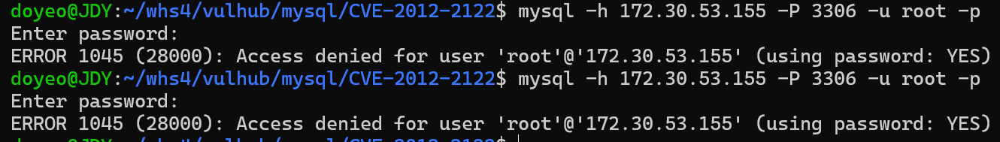
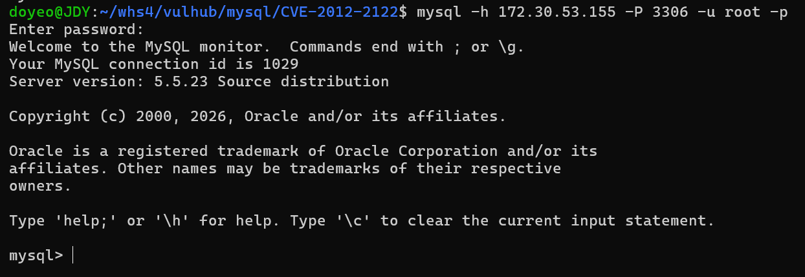
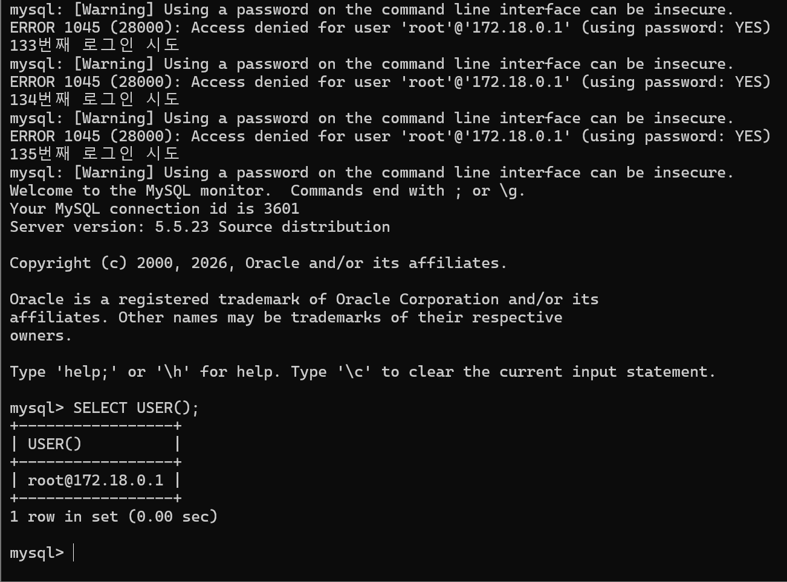

# CVE-2012-2122

> 화이트햇 스쿨 4기 - 전도연

<br/>

# 취약점 요약

발생 원인: 
MySQL 5.5.23 이하 버전 사용 → 취약점 존재 <br/>
취약 버전으로 인해 인증 과정에서 비밀번호 비교 결과를 잘못 처리하는 memcmp() 함수 오류 발생 <br/>
root@%로 모든 Host 허용 <br/>
→ 인증 우회 가능

어떤 문제가 발생하는지: <br/>
공격자가 correct pw를 모르더라도 반복적인 로그인 시도를 통해 DATABASE에 접근할 수 있다.

<br/>

# 환경 구성

```bash
sudo apt update
sudo apt upgrade -y
```

```bash
git clone https://github.com/vulhub/vulhub.git
```

```bash
cd vulhub
```

```bash
cd mysql/CVE-2012-2122
```

```bash
docker compose up -d
```

mysql 미설치 경우

```yaml
sudo apt update
sudo apt install default-mysql-client -y
```

<br/>

# 취약 조건

```yaml
version: '2'
services:
 mysql:
   image: vulhub/mysql:5.5.23
   ports:
    - "3306:3306"
```

MySQL  5.5.23 이하 버전을 사용. → 취약 가능성 있음.

계정 이름을 알고 있는 경우.

데이터베이스 서버(3306 port)에 접근 가능한 경우.

<br/>

# 재현 절차

```bash
mysql -h <사용자의 ip>  -P 3306 -u root -p
```

-h 172.30.53.155 : 접속할 서버의 ip 주소 

-P 3306 : 접속 포트 지정

-u root : 사용할 계정 지정

-p : 비밀번호 입력 요청

## 정상 접근 -  wrong pw

```bash
mysql -h <사용자의 ip>  -P 3306 -u root -p
```

비밀번호 : 123456이 아닌 무언가



## 정상 접근 - correct pw

```bash
mysql -h <사용자의 ip> -P 3306 -u root -p
```

비밀번호 : 123456



SQL 버전 : 5.5.23


<br/>

# poc.py
인증 우회가 발생할 때까지 최대 10000번 로그인 반복 시도 <br/>
`-pwrong` 으로 잘못된 비밀번호로 로그인 반복 시도 <br/>
취약점에 의해 인증 우회
```bash
python3 poc.py
```

<br/>

# 실행 결과



```sql
SHOW DATABASES;
USE mysql;
SHOW TABLES;
SHOW COLUMNS FROM mysql.user;
SELECT Host FROM mysql.user;
```

과 같은 명령어로 정보를 볼 수 있다
.
<br/>

# 대응 방안

취약점이 발생하지 않도록 MySQL 최신버전으로 업데이트를 한다. 

MySQL의 Port를 공개하지 않는다.

`root` 계정 원격 로그인을 비활성화 한다.

poc.py과 같이 반복 인증 시도를 모니터링 하여 공격을 탐지한다.

비밀번호 사용시 안전도를 높히기 위해 복잡한 비밀번호를 사용하도록 경고한다.
